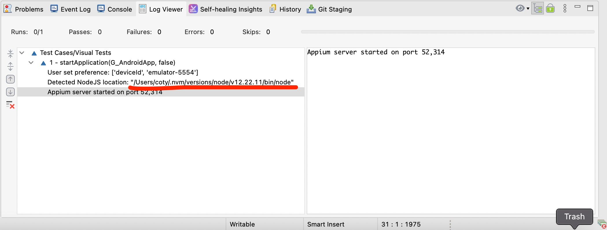

# Katalon Studio Samples: Android Visual Tests

This repository was originally cloned from the standard Android mobile test repository. It is intended specifically to demonstrate the use of image-based keywords that depend on integrating OpenCV with Appium.

## Configuring OpenCV for Appium on macOS 12.4 (Monterrey)

Configuring OpenCV to work with Appium and Katalon Studio is somewhat complicated. The following steps should get it working. They have been tested on an M1 MacBook Pro running macOS 12.4.

1. [Install Homebrew](https://docs.brew.sh/Installation)
1. [Install NVM](https://tecadmin.net/install-nvm-macos-with-homebrew/)
1. Install Node 12.22.11 using NVM and activate 12.22.11
   1. `nvm install 12.22.11`
   1. `nvm use 12.22.11`
1. `brew uninstall opencv`
1. `brew install cmake`
1. `brew upgrade cmake`
1. `npm install node-gyp`
1. `npm uninstall opencv-build`
1. `npm uninstall opencv4nodejs`
1. `export OPENCV4NODEJS_AUTOBUILD_FLAGS=-DBUILD_LIST=core,imgproc,imgcodecs,videoio,highgui,video,calib3d,features2d,objdetect,dnn,ml,flann,photo,stitching,gapi`
1. `npm install opencv4nodejs`
1. Link node_modules from NVM directory to /usr/local/lib
   1. `cd /usr/local/lib`
   2. `ln -s ~/.nvm/versions/node/v12.22.11/lib/node_modules .`

If you are successful in configuring OpenCV to work with Appium and Katalon Studio, you should see something like the following when you run the 'Visual Tests' test case:

Pay particular attention to the line containing the text "Detected NodeJS location:". It should reference the location of the NodeJS module in NVM.

## Companion products

### Katalon TestOps

[Katalon TestOps](https://analytics.katalon.com) is a web-based application that provides dynamic perspectives and an insightful look at your automation testing data. You can leverage your automation testing data by transforming and visualizing your data; analyzing test results; seamlessly integrating with such tools as Katalon Studio and Jira; maximizing the testing capacity with remote execution.

* Read our [documentation](https://docs.katalon.com/katalon-analytics/docs/overview.html).
* Ask a question on [Forum](https://forum.katalon.com/categories/katalon-analytics).
* Request a new feature on [GitHub](CONTRIBUTING.md).
* Vote for [Popular Feature Requests](https://github.com/katalon-analytics/katalon-analytics/issues?q=is%3Aopen+is%3Aissue+label%3Afeature-request+sort%3Areactions-%2B1-desc).
* File a bug in [GitHub Issues](https://github.com/katalon-analytics/katalon-analytics/issues).

### Katalon Studio
[Katalon Studio](https://www.katalon.com) is a free and complete automation testing solution for Web, Mobile, and API testing with modern methodologies (Data-Driven Testing, TDD/BDD, Page Object Model, etc.) as well as advanced integration (JIRA, qTest, Slack, CI, Katalon TestOps, etc.). Learn more about [Katalon Studio features](https://www.katalon.com/features/).

## Getting Started
These instructions will get you a copy of the project up and running on your local machine.
### Prerequisites
- [Katalon Studio](https://www.katalon.com/) - [Installation and Setup](https://docs.katalon.com/x/HwAM)
- [Android Studio](https://developer.android.com/studio/)
- Application Under Test (AUT)
  - [APIDemos.apk](https://github.com/katalon-studio-samples/android-mobile-tests/tree/master/androidapp/APIDemos.apk)
### Setting Up
- [Check out](https://git-scm.com/book/en/v2/Git-Basics-Getting-a-Git-Repository) the code from this repository
- [Open the project](https://docs.katalon.com//display/KD/Manage+Test+Project) from Katalon Studio
### Executing a Test Case

1. Expand the Test Cases structure, where all the test cases are stored.
2. Select the test case you want to execute
3. Choose the browser for executing the test case
At the end of this README, you will find additional ways to execute automation test cases. 

## See Also
Update configurations for integration: [Jira](https://docs.katalon.com/x/7oEw), [Katalon Analytics](https://docs.katalon.com/x/KRhO)

Katalon Documentation: http://docs.katalon.com/, especially some [Tips and Tricks](https://docs.katalon.com/x/PgXR) to run a successful automation test. 

Katalon Forum: https://forum.katalon.com/

Katalon Business Support: https://www.katalon.com/support-service-options/
